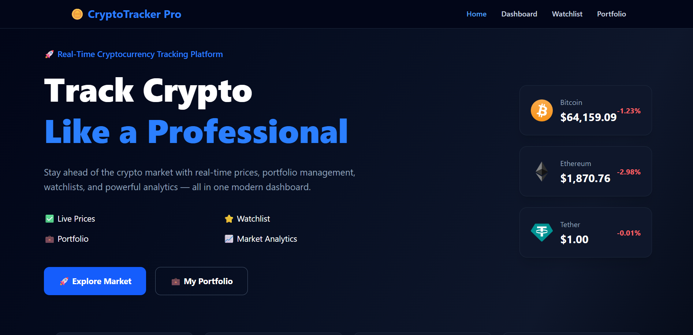
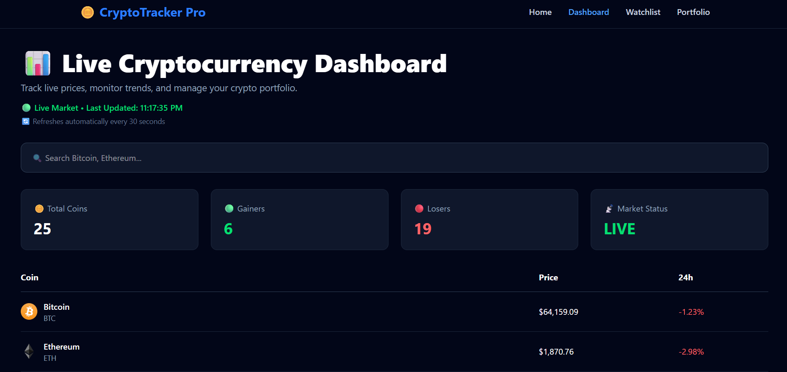
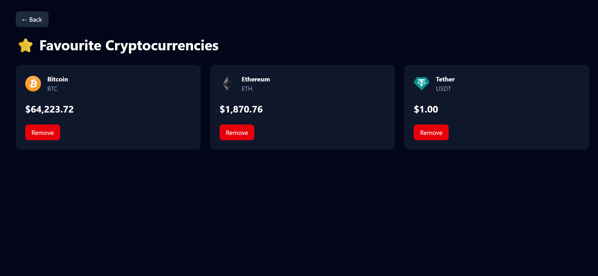
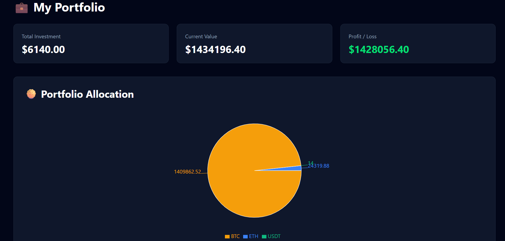
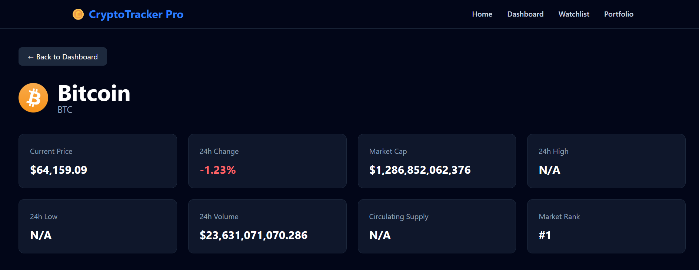

# 🚀 CryptoTracker Pro

A modern full-stack cryptocurrency tracking platform built with **React**, **FastAPI**, and the **CoinPaprika API**. CryptoTracker Pro enables users to monitor live cryptocurrency prices, analyze market trends, manage a personalized watchlist, and track their investment portfolio through a clean, responsive, and interactive interface.

---

# 🌐 Live Demo

### 🚀 Frontend (Vercel)
https://crypto-tracker-pro-pearl.vercel.app/

### ⚙️ Backend API (Render)
https://cryptotracker-pro-backend.onrender.com/

---

# 📸 Screenshots

### 🏠 Landing Page

.png)

### 📊 Dashboard


### ⭐ Watchlist


### 💼 Portfolio

.png)

### 📈 Coin Details

.png)

---

# ✨ Features

## 📈 Live Cryptocurrency Dashboard
- View the top 25 cryptocurrencies
- Live cryptocurrency prices
- Automatic market refresh every 30 seconds
- Search coins by name or symbol
- Live market status indicator
- Last updated timestamp

## 📊 Market Analytics
- Total tracked cryptocurrencies
- Number of gainers and losers
- Real-time market overview
- Responsive statistics cards

## 🪙 Coin Details
- Current price
- 24-hour percentage change
- Market capitalization
- Trading volume
- Circulating supply
- Market rank
- Interactive price history chart

## ⭐ Watchlist
- Add cryptocurrencies to favorites
- Remove cryptocurrencies anytime
- Global state management using React Context API
- Instant toast notifications

## 💼 Portfolio Tracker
- Add investment entries
- Track buy price and quantity
- View current portfolio value
- Profit & Loss calculation
- Portfolio allocation visualization
- Remove investments

## 🎨 User Experience
- Modern responsive UI
- Animated loading screen
- Error handling with retry option
- Toast notifications
- Custom 404 page
- Mobile-friendly design

---

# 🛠 Tech Stack

## Frontend
- React.js
- Vite
- Tailwind CSS
- React Router DOM
- Axios
- Recharts
- React Toastify

## Backend
- FastAPI
- Python
- HTTPX
- Uvicorn

## API
- CoinPaprika API

## Deployment
- Vercel
- Render
- GitHub

---

# 📂 Project Structure

```text
CryptoTracker-Pro/
│
├── frontend/
│   ├── public/
│   ├── src/
│   │   ├── assets/
│   │   ├── components/
│   │   ├── context/
│   │   ├── pages/
│   │   ├── routes/
│   │   ├── services/
│   │   ├── App.jsx
│   │   └── main.jsx
│   ├── package.json
│   └── vite.config.js
│
├── backend/
│   ├── app/
│   │   ├── api/
│   │   ├── services/
│   │   └── main.py
│   ├── requirements.txt
│   └── venv/
│
├── README.md
└── .gitignore
```

---

# 🚀 Getting Started

## 1️⃣ Clone the Repository

```bash
git clone https://github.com/Krishh-22/CryptoTracker-Pro.git
cd CryptoTracker-Pro
```

---

## 2️⃣ Frontend Setup

```bash
cd frontend
npm install
npm run dev
```

Frontend runs on:

```
http://localhost:5173
```

---

## 3️⃣ Backend Setup

```bash
cd backend
```

Create a virtual environment:

```bash
python -m venv venv
```

### Activate Virtual Environment

#### Windows

```bash
venv\Scripts\activate
```

#### Linux / macOS

```bash
source venv/bin/activate
```

Install dependencies:

```bash
pip install -r requirements.txt
```

Run the FastAPI server:

```bash
uvicorn app.main:app --reload
```

Backend runs on:

```
http://127.0.0.1:8000
```

---

# 📡 API Endpoints

## Get Live Market Data

```http
GET /market
```

Returns live information for the top cryptocurrencies.

---

## Get Coin Price History

```http
GET /coin/{coin_id}/history
```

Returns historical price data for the selected cryptocurrency.

---

# 🚀 Deployment

### Frontend

- **Platform:** Vercel

### Backend

- **Platform:** Render

---

# 📈 Future Enhancements

- 🔐 User Authentication
- 🗄 Database Integration
- 🔔 Price Alerts
- 🌙 Dark / Light Theme
- 📈 Trending Coins Section
- 🌍 Global Crypto Market Statistics
- 📰 Cryptocurrency News Feed
- 📱 Progressive Web App (PWA)
- 📊 Advanced Portfolio Analytics

---

# ⚠️ Note

- Cryptocurrency market data is provided by the **CoinPaprika API**.
- Live prices depend on the availability of the external API service.
- Free hosting platforms (Render and Vercel) may have a short cold-start delay after inactivity.

---

# 👨‍💻 Author

**Krishna**

B.Tech Computer Science Student | Full-Stack Developer | Python Enthusiast

## Skills Demonstrated

- React.js
- FastAPI
- Python
- REST API Integration
- State Management (Context API)
- Axios
- Responsive UI Design
- Data Visualization
- Git & GitHub
- Vercel Deployment
- Render Deployment